# Analysis-of-Employees-
Analysis of Employees Using SQL

## Introduction
This task of data analysis was done using SQL. In this analysis, SQL was used to create a database and also solve some basic questions. I used PostgreSQL to carry out data analysis.

## Problem Statement
To solve and provide solutions to the following problems and questions.
1. Select the employee table and show the data where the city is Mumbai and Delhi
2. Select the employee table where the employee's first name has both 'a' and 'e' in them.
3. Subset the employee table to have the employees with a date of birth above 1990.
4. Subset the salary table to show salaries less than 1 million and sort it in ascending order.
5. Total number of employees in the employee table?
6. Top 5 cities with the highest number of employees, filter the result to show cities with more than 15 employees.
7. The most used Pincode by the employee. Most used pincode by employees.

## Skills Demonstrated
1. Creation of Database
2. Creation of Table
3. SELECT * FROM table name
4. Insert Into
5. Values
6. Where clause
7. Count(*) 

## Data Analysis
I had to create a database in pgadmin4. I made use of PostgreSQL for my SQL task.
Firstly, Since we were provided with the data in a CSV file, we had to upload the data into the table created.
- Click on the database created
- Then click on Query tool
- Create a table for employee
- Then type the following code in your query tool

To upload the data into the table for PostgreSQL, 
- Right-click on table
- Select Import/Export Data
- Select import
- choose the location of your csv file on your system
- Click on columns and make sure all columns match the columns on data on csv file
- Then select header is turned on
- Then press ok.

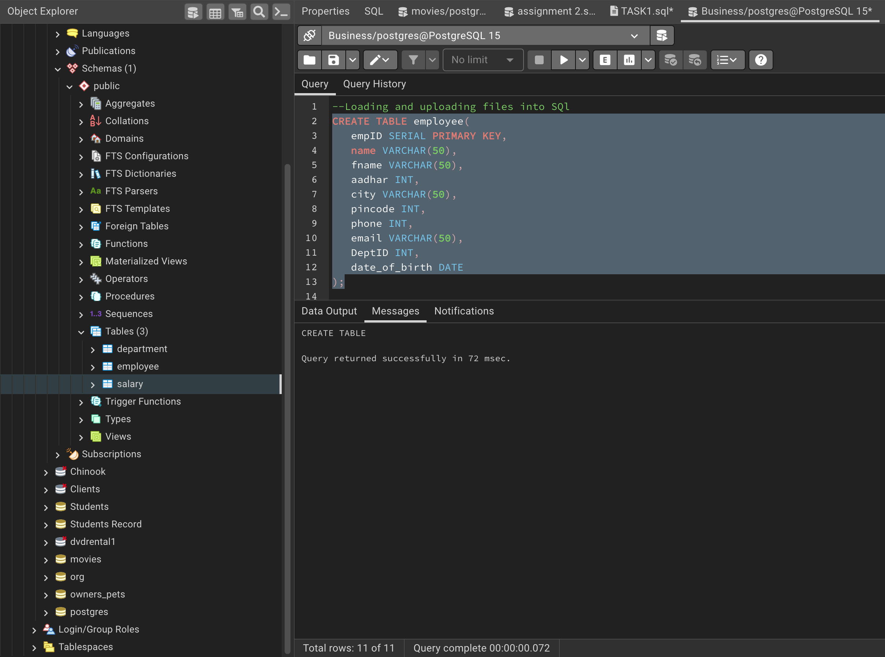

- To upload the salary data into the table, you have to change the column data type from numeric to VARCHAR

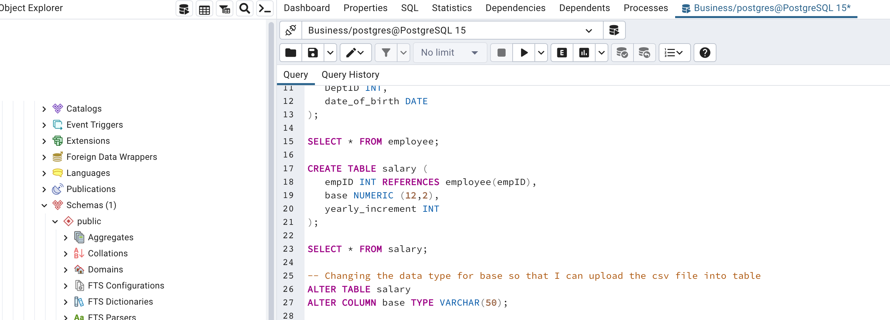

- To check if the employee data has been uploaded into the table, SELECT * FROM employee and it returns the table completely full with data.

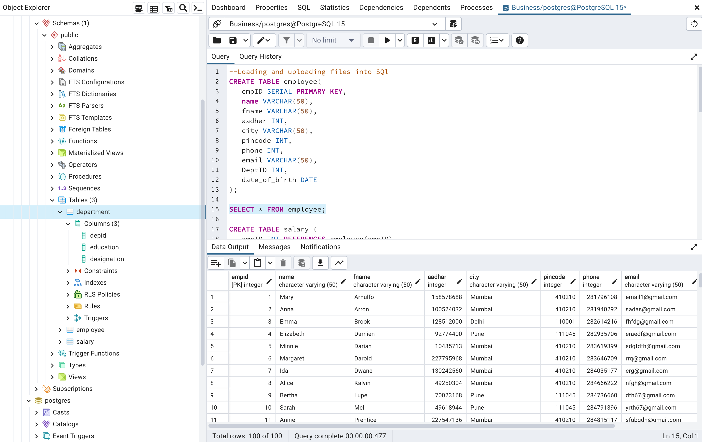

- Type SELECT * FROM salary to get the salary table full of data.

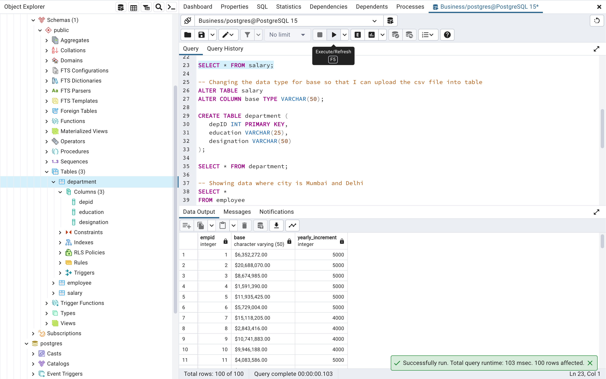

- Type SELECT * FROM department to get the department table full of data.

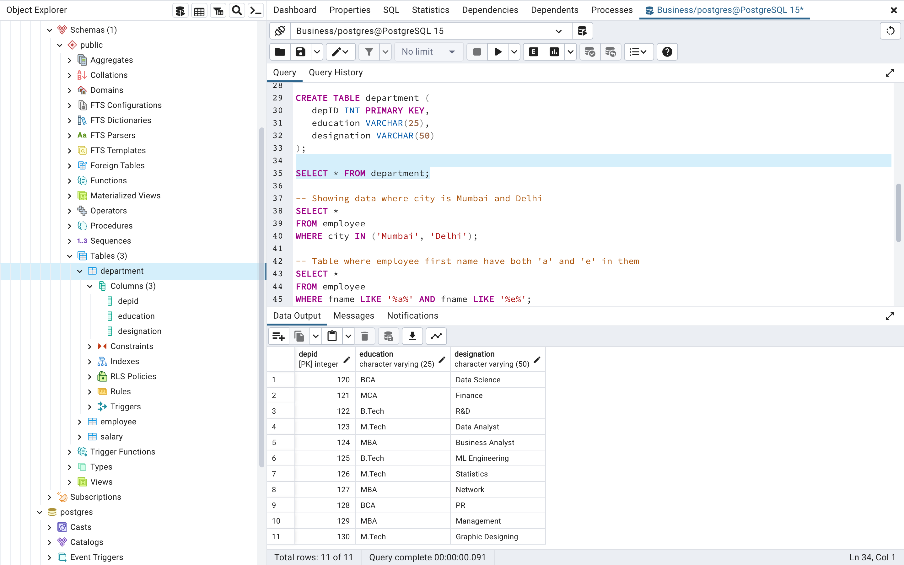

- To get the employee table and show the data where the city is Mumbai and Delhi.

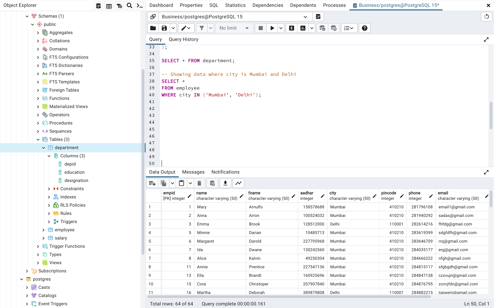

- To get the employee table where the employee's first name has both 'a' and 'e' in them.

- To Subset the employee table to have employees with a date of birth above 1990.

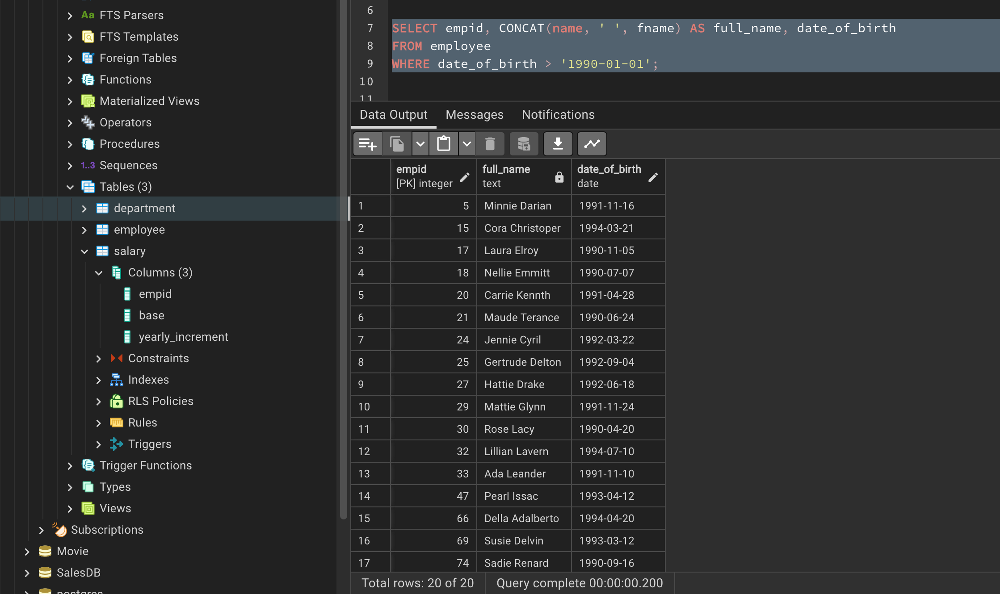
  
- To Subset the salary table to show salaries less than 1 million and sort it in ascending order.

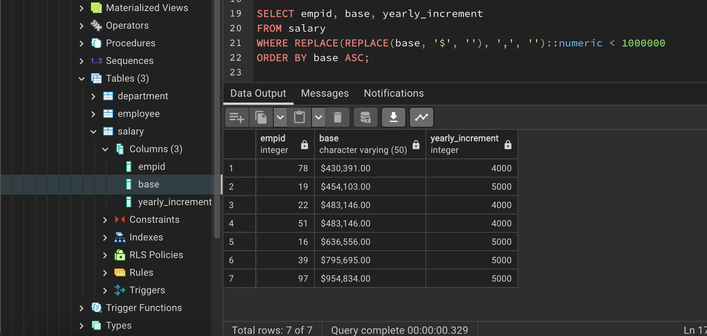

- Total number of employees in the employee table

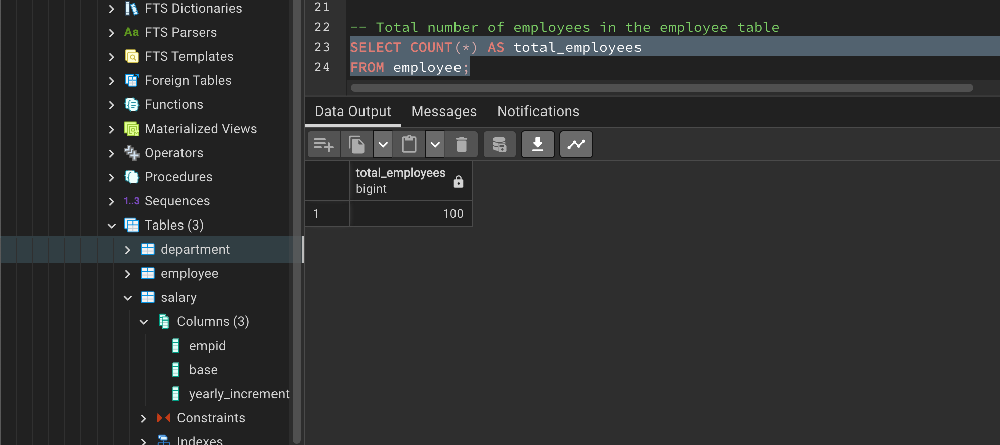

- Top 5 cities with the highest number of employees, filter the result to show cities with more than 15 employees.

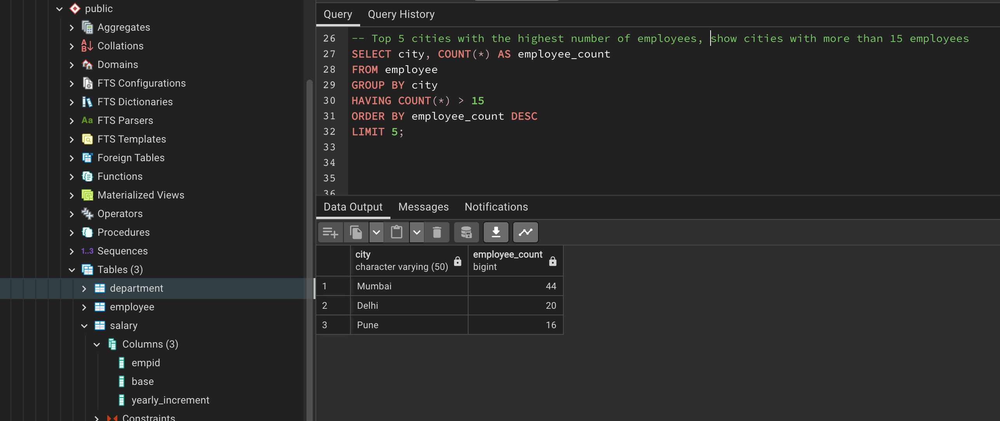

- The most used pincode by employees.

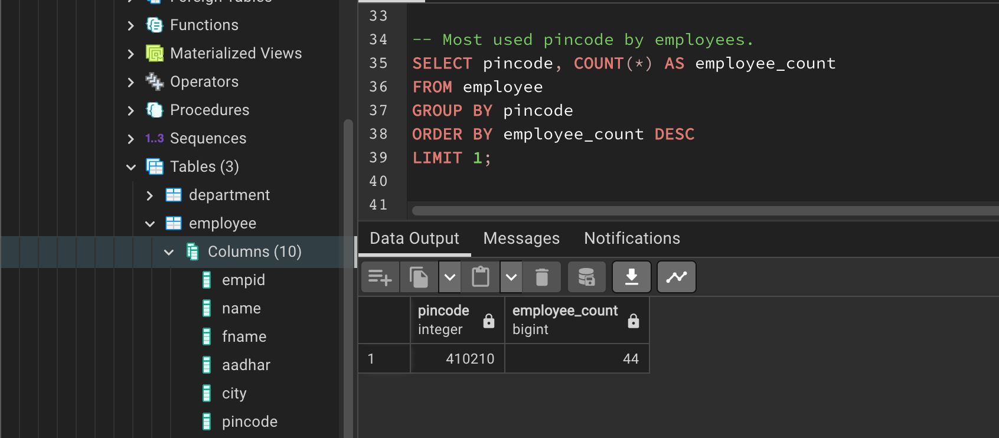

## Conclusion
Getting a little hang of SQL so I am beginning to play around with it, had to understand the basic or starting point of working with SQL which is the 
- SELECT, FROM, INSERT INTO, VALUES, ALTER TABLE, ALTER COLUMNS. 
- Knowing the data type (integer, character, character varying, identity/serial, date, numeric, primary key, foreign key.
- We have 7 employees who earn below the $1 million mark
- We have 14 employees who were born after 1990.
- We have 64 employees located where the city is Mumbai and Delhi.
- We have a total number of 100 employees in the company
- We have 3 cities with the highest number of employees above 15, they are Mumbai with 44, Delhi with 20 and Pune with 16.
- The pincode with the most usage with the employees is 410210.
